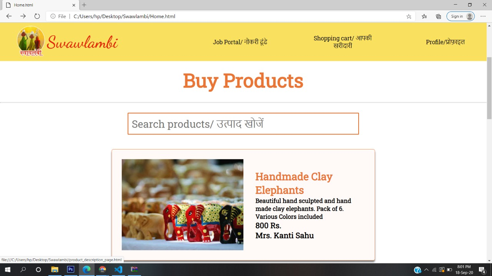
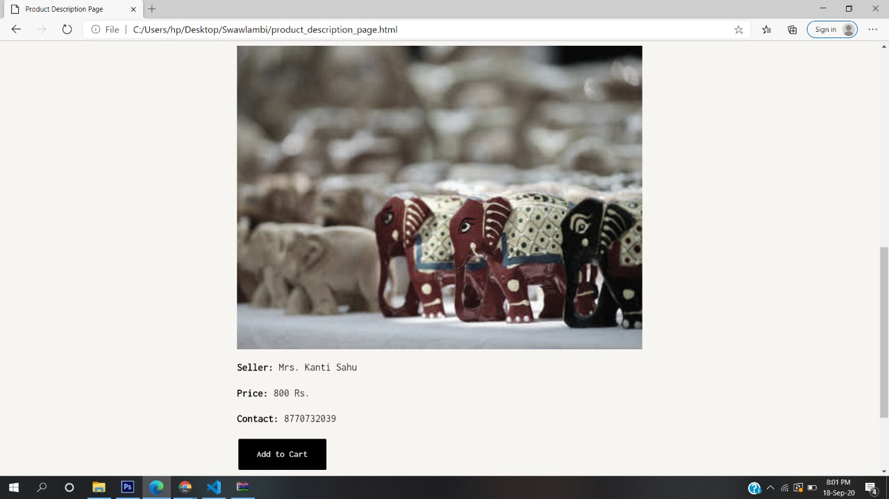
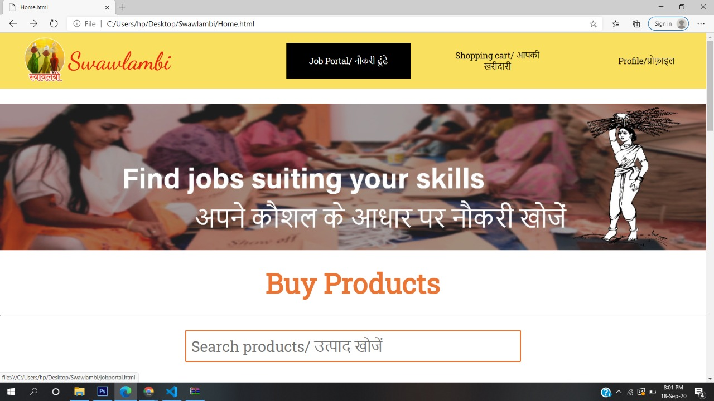
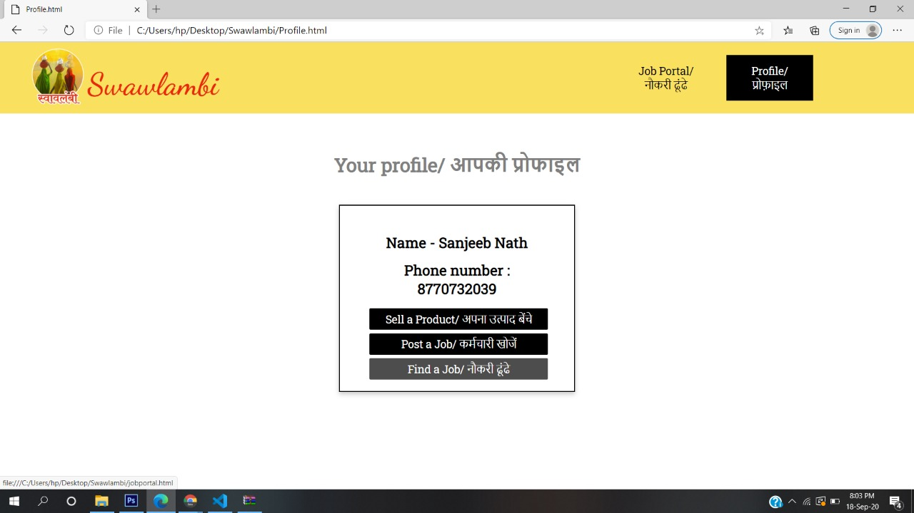
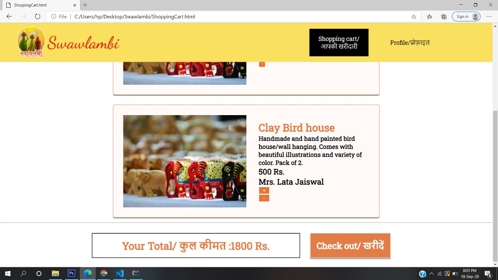
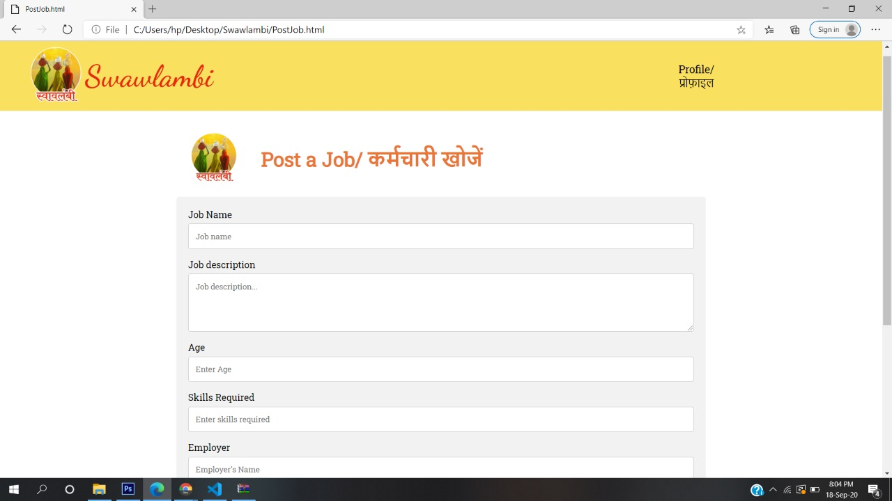
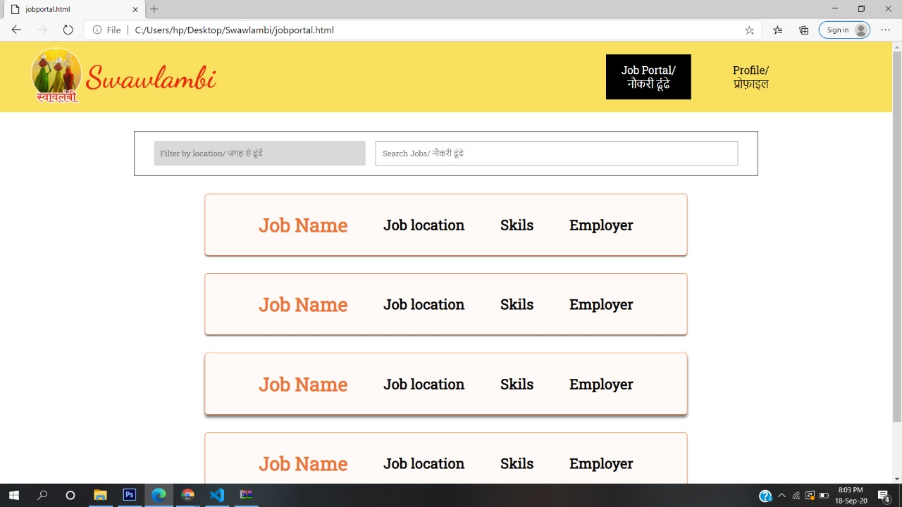
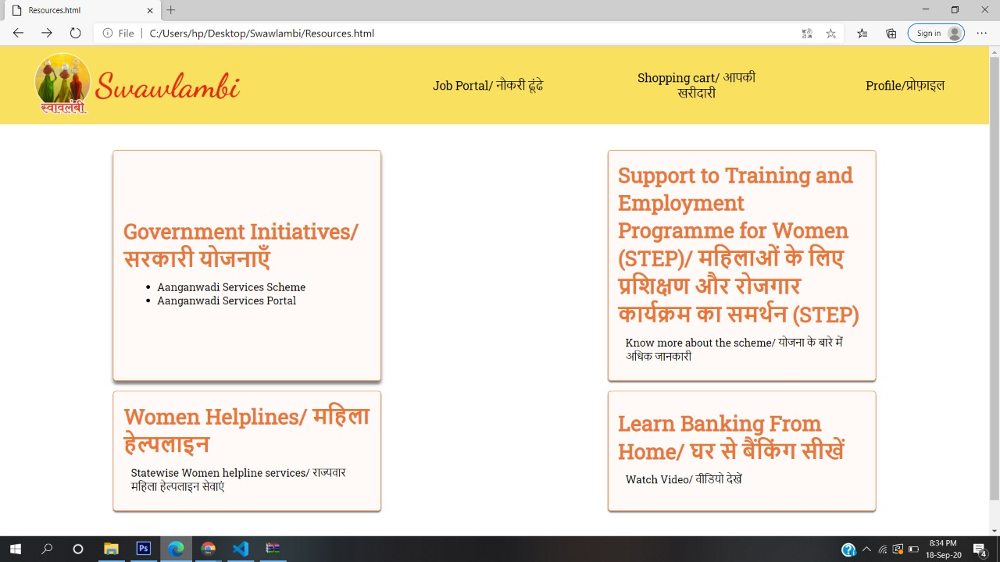

# Swawlambi

A website aimed at uplfiting lives of rural women with employment and welfare.
Official submission for Hack4Women 2020 Hackathon.

## Overview

We have built a fully functional website called "Swawlambi", with the aim to provide employment oppourtunities to all the women accross rural areas. We focus on both the skilled as well as the unskilled sectors of employment. The website has 2 main components. First one is the Job Portal for women looking for jobs in the skilled or unskilled sectors. It provides a list of jobs from various employers posted in it, having separate login as an employer or an applicant. Women can select the jobs according to their preference of skills and location., and apply accordingly. Second Component is a buying-selling platform for the household self-employed women willing to sell their homemade objects like handicrafts, farm products, etc. The buyer can buy as much as he/she wants, add it to cart and pay for it (which would help them support their livelihoods). Lastly we tend to provide some resources and awareness about government schemes for rural women for their upliftment. We provide a one-stop solution and guide for the rural women to become self-dependant hence rightly called "Swawlambi".

## Features

* The website provides a platform to sell the homemade items made my the rural women.
* Rural Women can upload their items and the details of it.
* Any user has the option of buying any item displayed to them.
* Any user can put any number of items in the shopping cart feature.
* The platform provides opportunities to the rural women who may be of skilled or unskilled alike.

## Technology Stack

### Web Technology

- Frontend
  - HTML
  - CSS
  
- Backend
  - PHP
  - MySQL (Database)

- Tools
  - Xampp
  - Git
  - Github

## Setup

- Download & install [Xampp](https://www.apachefriends.org/download.html)
- Download the Zip or clone the repository
``` bash
git clone https://github.com/aryansarkar13/Swawlambi.git
```
- Go to the directory where Xampp is installed. For eg. C:\xampp\htdocs
- Copy the project folder and paste it in the address mentioned above.
- Launch any browser window and search localhost/swawlambi.
- Voila, explore and enjoy!

## Presentation

Find our project presentation [here](https://docs.google.com/presentation/d/10HWiTnIscaXbwCRBVtE8V61aG55zkboYL_-3qf5v9do/edit?usp=sharing)

## Screenshots










## Our Team

* Aryan Sarkar
* Sanjeeb Nath
* Anjali Patle
* Anany Sharma
* Sakshi Bhandarkar

### More power to women!
